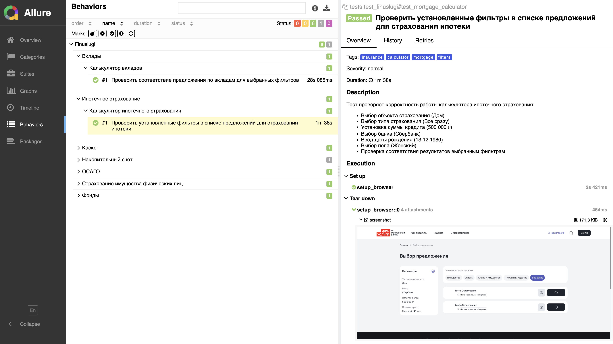

# Автотесты для Finuslugi.ru

<p align="center">
  
  
  
  
  
  
  
  
</p>

## Описание

Проект автоматизированного тестирования веб-сайта [finuslugi.ru](https://finuslugi.ru) — сервиса финансовых услуг.

Тесты покрывают основные калькуляторы и фильтры:
- 💰 Вклады
- 📊 Фонды
- 💳 Накопительные счета
- 🚗 КАСКО
- 🚙 ОСАГО
- 🏠 Ипотечное страхование
- 🏡 Страхование имущества

## Технологии

- **Python** — язык программирования
- **Pytest** — фреймворк для тестирования
- **Selene** — обёртка над Selenium для удобной работы с элементами
- **Selenium** — инструмент для автоматизации браузера
- **Selenoid** — для запуска тестов в Docker-контейнерах
- **Allure** — генерация отчётов
- **Jenkins** — CI/CD
- **Telegram** — уведомления о результатах

## Структура проекта

```
.
├── pages/                      # Page Object классы
│   ├── accumulation_account_page.py
│   ├── deposit_page.py
│   ├── fond_page.py
│   ├── home_page.py
│   ├── kasko_page.py
│   ├── mortgage_insurance_page.py
│   ├── osago_page.py
│   └── property_insurance_page.py
├── tests/                      # Тесты
│   ├── conftest.py
│   └── test_finuslugi.py
├── utils/                      # Утилиты
│   └── attach.py
├── media/icons/                # Иконки для README
├── allure-results/             # Результаты Allure
├── pyproject.toml              # Зависимости Poetry
└── pytest.ini                  # Конфигурация Pytest
```

## Установка и запуск

### Предварительные требования

- Python 3.9+
- Poetry

### Установка зависимостей

```bash
poetry install
```

### Запуск тестов

Запуск всех тестов:
```bash
poetry run pytest tests/
```

Запуск с генерацией Allure-отчёта:
```bash
poetry run pytest tests/ --alluredir=allure-results
```

## Отчет в allure
#### 

Запуск конкретного теста:
```bash
poetry run pytest tests/test_finuslugi.py::test_deposit_calculator
```

### Просмотр Allure-отчёта

```bash
allure serve allure-results
```

## Особенности

- Использование паттерна Page Object для удобной поддержки
- Подробная Allure-разметка с описаниями, тегами и уровнями критичности
- Автоматические скриншоты и логи при падении тестов
- Поддержка xfail для нестабильных тестов

